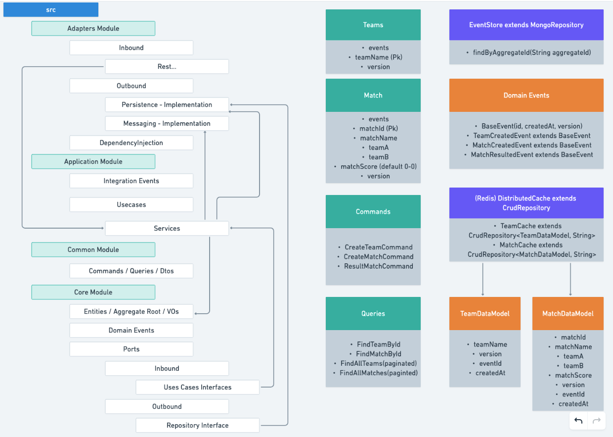

# Match Tracker - Hexagonal Architecture in a Java project with Spring Boot
## Summary
This is my interpretation of **Hexagonal (or Ports & Adapters)** Architecture and the theme of the project is Match Tracker which lets create teams, create matches and update / track it's state.

I wanted specifically to do this in separate modules, so I could see a clearer separation of the several units as completely isolated components. These modules would have **Dtos, Commands and Queries** as contracts to communicate between each other which were included in the **common module**. The **common module** was necessary as way to avoid *Circular Dependency* problems between **core module** and **application module**.

Any external implementations of *Presentation, Frameworks and Db's* (like Spring boot, Controllers, MongoDb and Redis in this case) are isolated in the **adapters module**.

I also wanted to segregate the **application module**, containing the Use Cases implementation from the **adapters module**, making this module much closer to what you'd see in *Infrastructure layer* in *Clean Architecture*.
This **application module** ends up being an Adapter still, just abstracted from any frameworks/dbs implementations so it's written in plain Java, which is implementing one **Port** defined in the **core module**.

The **core module** holds business logic, and it's written in plain Java. I made a simplified version of **DDD**, meaning relaxed implementation of DDD without Value Objects even...

I also shoved in **Event Sourcing** to this mix, so the domain aggregates and the core reflect that logic and have its domain events there.
Although I managed to implement it in this architecture I felt like when doing **CQRS** you'll get a cleaner app with Event Sourcing.

Since I'm doing Event Sourcing, I decided to go with **MongoDb** to store those Events via *Polymorphic Objects implementation* (which is quite abstracted with Spring Data MongoDB)

As something special I wanted to do for this project was to add **Redis** as a **Distributed Cache** mechanism.
This came with some challenges. Due to **Redis** key - value based approach and the nature of storing event streams rather than state of the entities and the fact that I'm querying all data based on **aggregateId** and never by the **eventId** which is the unique Id of an **EventDataModel** makes it impossible to make this 1:1 storage of a list of events with **aggregateId** as a key.
What would happen in that scenario is that for each event processed with the same **aggregateId Redis** would overwrite the previous event information. This is a problem because not all events have the same fields and therefore you cannot rebuild successfully the Aggregate after.
One solution could be using Secondary Indexes. I didn't explore this much.
My solution was to make the cache hold state of the complete aggregates instead of storing events, so I have a **TeamDataModel** and a **MatchDataModel**.

I also implemented a **Kafka** Producer to send the created events to any interested consumers. Consumers were not done.

## General Structure / Idea


## Testing the app
You can spin up instances of the app and test them in swagger at **http://localhost:<port>/swagger-ui/index.html**

## To check data in redis-cli
```bash
redis-cli
keys *
HGETALL <key>
```
## To delete all data in redis-cli
```bash
FLUSHALL
```

## To spin up the containers for the app to run
```bash
docker-compose up -d
```

## Conclusions
1. Hexagonal (Ports & Adapters) Architecture shows a very neat way to centralize business logic in the core module and to isolate this module to any external framework dependencies while providing nice interfaces which leaves you free to implement one or many frameworks, db's etc without touching any of the core logic.
2. Applying Event Sourcing in this Architecture while it's possible it seems more complicated than doing it in CQRS but at the same time CQRS is only really CQRS when you have different apps for commands and queries, which is something I didn't want to do here.
3. Redis as cache mechanism when you want to store Events is not the best solution, although I made it work.
4. I'm using the same Sourcing Handlers and then also all the logic to store data for 2 different aggregates. These should be separated as this is a big source of bugs.
5. Since I'm handling 2 aggregates at once, maybe it could be nice to abstractions that use reflection to determine types instead of a bunch of if statements like it's done.